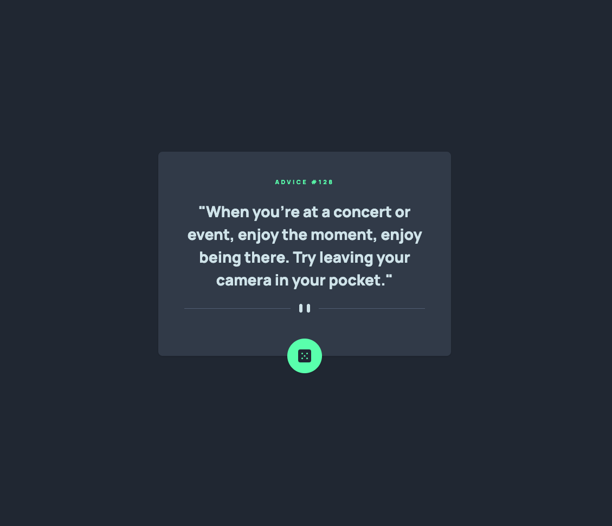

# Frontend Mentor - Advice generator app solution

This is a solution to the [Advice generator app challenge on Frontend Mentor](https://www.frontendmentor.io/challenges/advice-generator-app-QdUG-13db).

## Table of contents

-  [Overview](#overview)
   -  [The challenge](#the-challenge)
   -  [Screenshot](#screenshot)
   -  [Links](#links)
-  [My process](#my-process)
   -  [Built with](#built-with)
   -  [What I learned](#what-i-learned)
   -  [Continued development](#continued-development)
-  [Author](#author)

## Overview

### Requirements

Users should be able to:

-  View the optimal layout for the app depending on their device's screen size
-  See hover states for all interactive elements on the page
-  Generate a new piece of advice by clicking the dice icon

### Screenshot

Add a screenshot of your solution. The easiest way to do this is to use Firefox to view your project, right-click the page and select "Take a Screenshot". You can choose either a full-height screenshot or a cropped one based on how long the page is. If it's very long, it might be best to crop it.

Alternatively, you can use a tool like [FireShot](https://getfireshot.com/) to take the screenshot. FireShot has a free option, so you don't need to purchase it.

Then crop/optimize/edit your image however you like, add it to your project, and update the file path in the image above.

**Note: Delete this note and the paragraphs above when you add your screenshot. If you prefer not to add a screenshot, feel free to remove this entire section.**

### Links

-  Solution URL: [Github Repository](https://github.com/jacksonwhiting/advice-generator-app)
-  Live Site URL: [Live Site](https://jw-advice-generator-app.netlify.app/)

## My process

### Built with

-  Semantic HTML5 markup
-  CSS custom properties
-  Flexbox
-  CSS Grid
-  Mobile-first workflow
-  Tailwind CSS
-  Vanilla Javascript

### What I learned

This was my first opportunity working with Promises, Fetch API and Async Functions. All great experience.

I had two issues with the app that I'm still brainstorming:

-  The icson seems to go inactive for a period of time while the data is being fetched. If I click the button twice in a row within a certain timeframe, the second click does nothing.

-  For some reason, Firefox is giving me issues fetching data when clicking the icon. All other browsers work fine. Firefox will fetch the data and display it on startup. It will also fetch and work perfectly when I have the developer tools open. When I close the developer tools, the icon click no longer works and I can't figure out why.

### Continued development

Keep learning more efficient ways to fetch and display data.

## Author

-  Frontend Mentor - [@jacksonwhiting](https://www.frontendmentor.io/profile/jacksonwhiting)
-  Twitter - [@JWhiting00](https://www.twitter.com/JWhiting00)
